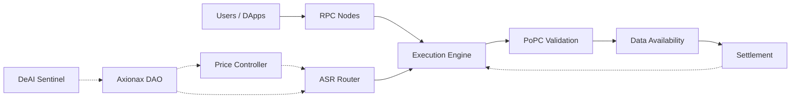

# Axionax Core

> Layer-1 blockchain for decentralized compute with PoPC consensus, ASR auto-selection, and DeAI security

[](https://opensource.org/licenses/MIT)
[](https://github.com/axionaxprotocol/axionax-core/releases)
[](https://github.com/axionaxprotocol/axionax-core/projects)

## 🎯 Vision

Axionax is a Layer-1 blockchain that unifies **Execution**, **Validation (PoPC)**, **Data Availability**, and **Settlement** with emphasis on performance, transparency, and security for decentralized compute markets.

## ✨ Key Features

- **🎲 Proof-of-Probabilistic-Checking (PoPC)**: Scalable validation through statistical sampling (O(s) verification cost)
- **🤖 Auto-Selection Router (ASR)**: Protocol-driven worker assignment (no auctions) with fairness guarantees
- **💰 Posted Price Controller**: Dynamic pricing based on utilization and queue length
- **🛡️ Advanced Security**: Delayed VRF, stratified sampling, replica diversity, fraud-proof window
- **🤖 DeAI Sentinel**: Real-time anomaly detection and DAO reporting
- **🏛️ DAO Governance**: Community-driven parameter tuning

## 🏗️ Architecture



📖 **[Full Architecture Documentation →](./ARCHITECTURE.md)**

## 🚀 Quick Start

### Prerequisites

- Go 1.21+ or Rust 1.75+
- 16GB RAM minimum
- 500GB SSD storage

### Installation

```bash
# Clone the repository
git clone https://github.com/axionaxprotocol/axionax-core.git
cd axionax-core

# Build from source
make build

# Run testnet node
./axionax-core start --network testnet
```

### Running a Validator

```bash
# Generate validator keys
./axionax-core keys generate --type validator

# Stake AXX tokens
./axionax-core stake --amount 10000 --address <your-address>

# Start validating
./axionax-core validator start
```

### Running a Worker (Compute Provider)

```bash
# Register as worker
./axionax-core worker register --specs <hardware-spec.json>

# Start accepting jobs
./axionax-core worker start
```

## 📊 Tokenomics

- **Total Supply**: 1,000,000,000,000 AXX (1 Trillion, fixed cap)
- **Emission Rate**: ~2.25% APY from Ecosystem Reserve
- **Token Utilities**: Gas fees, Staking, Medium of Exchange, Governance

📖 **[Full Tokenomics Documentation →](./TOKENOMICS.md)**

## 🗺️ Roadmap

| Phase | Timeline | Status | Key Deliverables |
|-------|----------|--------|------------------|
| **v1.5 Testnet** | Q4'25 - Q1'26 | 🟡 In Progress | PoPC, ASR, PPC, DeAI Sentinel MVP |
| **v1.6 Production DA** | Q2'26 | 📅 Planned | Erasure coding, DA optimizer |
| **v1.7 Governance** | Q3'26 | 📅 Planned | DAO hardening, permissionless onboarding |
| **Mainnet Genesis** | Q3'26 - Q2'27 | 📅 Planned | Public launch, SDK/CLI tools |
| **Guardian Nodes** | Q3'28 - Q2'29 | 🔬 Research | Space-based validator nodes |

📖 **[Full Roadmap →](./ROADMAP.md)**

## 📚 Documentation

- **[Project Status](./STATUS.md)** - Current status and next steps
- **[Architecture Overview](./ARCHITECTURE.md)** - System design and component breakdown
- **[Whitepaper v1.5](./docs/whitepaper_v1_5_EN.md)** - Technical specifications
- **[Security Model](./SECURITY.md)** - Threat model and mitigations
- **[Governance Guide](./GOVERNANCE.md)** - DAO participation
- **[API Reference](./docs/API_REFERENCE.md)** - Developer documentation
- **[Contributing](./CONTRIBUTING.md)** - How to contribute

## 🔐 Security

Key security mechanisms:
- **Delayed VRF** (k-block) for challenge selection
- **Stratified + Adaptive Sampling** for coverage
- **Replica Diversity** to prevent collusion
- **Fraud-Proof Window** with validator accountability
- **DA Pre-commit** with live audits

🐛 **Found a vulnerability?** Please report to security@axionax.io (PGP key available)

## 🤝 Contributing

We welcome contributions! Please see our [Contributing Guide](./CONTRIBUTING.md) for details.

### Development Workflow

1. Fork the repository
2. Create a feature branch (`git checkout -b feature/amazing-feature`)
3. Commit your changes (`git commit -m 'Add amazing feature'`)
4. Push to the branch (`git push origin feature/amazing-feature`)
5. Open a Pull Request

## 📜 License

This project is licensed under the MIT License - see the [LICENSE](./LICENSE) file for details.

## 🔗 Links

- **Website**: https://axionax.io
- **Documentation**: https://docs.axionax.io
- **Discord**: https://discord.gg/axionax
- **Twitter**: https://twitter.com/axionaxprotocol
- **Telegram**: https://t.me/axionax

## 🙏 Acknowledgments

Built with inspiration from:
- Ethereum's execution layer
- Celestia's data availability
- Filecoin's proof mechanisms
- Akash Network's compute marketplace

---

**⚠️ Testnet Disclaimer**: This software is currently in testnet phase. Do not use on mainnet with real assets until official production release.

Made with 💜 by the Axionax community
