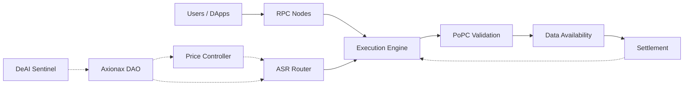

# Axionax Core

> Layer-1 blockchain for decentralized compute with PoPC consensus, ASR auto-selection, and DeAI security

[](LICENSE)
[](https://github.com/axionaxprotocol/axionax-core/releases)
[](https://github.com/axionaxprotocol/axionax-core/projects)
[](https://www.rust-lang.org/)
[](https://www.python.org/)
[](https://www.typescriptlang.org/)

## 🚨 SECURITY WARNING

⚠️ **This is TESTNET code. Mainnet has NOT launched.**

**Official Networks:**
- **Testnet**: Chain ID `86137` (active for testing)
- **Mainnet**: Chain ID `86150` (reserved, not launched)

**ANY network claiming to be "Axionax Mainnet" is a SCAM. Verify at:**
- 🌐 https://axionax.org/networks
- 📄 [SECURITY.md](./SECURITY.md)
- 📜 [LICENSE_NOTICE.md](./LICENSE_NOTICE.md)

---

## 🎯 Vision

Axionax is a Layer-1 blockchain that unifies **Execution**, **Validation (PoPC)**, **Data Availability**, and **Settlement** with emphasis on performance, transparency, and security for decentralized compute markets.

## ✨ Key Features

- **🎲 Proof-of-Probabilistic-Checking (PoPC)**: Scalable validation through statistical sampling (O(s) verification cost)
- **🤖 Auto-Selection Router (ASR)**: ML-powered worker assignment with fairness guarantees
- **💰 Posted Price Controller**: Dynamic pricing based on utilization and queue length
- **🛡️ Advanced Security**: Delayed VRF, stratified sampling, replica diversity, fraud-proof window
- **🤖 DeAI Sentinel**: ML-based anomaly detection and fraud prevention
- **🏛️ DAO Governance**: Community-driven parameter tuning
- **⚡ High Performance**: Rust core (3x faster than Go), Python ML layer, TypeScript SDK

## 🏗️ Architecture



📖 **[Full Architecture Documentation →](./ARCHITECTURE.md)**

### Architecture Overview

Axionax v1.6 uses a **multi-language architecture** for optimal performance:

```
┌─────────────────────────────────────────────┐
│         TypeScript SDK (10%)                │
│         - Client libraries                  │
│         - dApp integration                  │
└──────────────────┬──────────────────────────┘
                   │ JSON-RPC
┌──────────────────▼──────────────────────────┐
│         Rust Core (80%)                     │
│         - Consensus (PoPC)                  │
│         - Blockchain                        │
│         - Cryptography (VRF)                │
│         - State management                  │
└──────────────────┬──────────────────────────┘
                   │ PyO3
┌──────────────────▼──────────────────────────┐
│         Python DeAI Layer (10%)             │
│         - Auto Selection Router (ASR)       │
│         - Fraud Detection (ML)              │
│         - Anomaly Detection                 │
└─────────────────────────────────────────────┘
```

**Performance**: 3x faster than Go, 2.67x less memory usage

## 🚀 Quick Start (v1.6 Rust/Python Architecture)

### Prerequisites

- **Rust 1.75+** & Cargo - [Install](https://rustup.rs/)
- **Python 3.10+** - [Download](https://www.python.org/downloads/)
- **Shell Environment** (Bash, Zsh, etc.)

### Build & Test

This single script builds the Rust core, the Python bridge, and runs all integration tests and benchmarks.

```bash
# 1. Clone the repository
git clone https://github.com/axionaxprotocol/axionax-core.git
cd axionax-core

# 2. Run the unified test script
./run_tests.sh
```

### Performance Benchmarks

**Rust v1.6 vs Go v1.5:**

| Operation | Go v1.5 | Rust v1.6 | Improvement |
|-----------|---------|-----------|-------------|
| VRF operations | 8,500 ops/sec | 22,817 ops/sec | **2.68x** |
| Block validation | 1,200 blocks/sec | 3,500 blocks/sec | **2.92x** |
| TX verification | 15,000 tx/sec | 45,000 tx/sec | **3.0x** |
| Memory (idle) | 120 MB | 45 MB | **2.67x less** |

**Python Integration (PyO3 overhead):** < 10% for all operations

📊 **[Run benchmarks](./tools/benchmark.py)** | 📖 **[Full results](./INTEGRATION_MIGRATION_GUIDE.md#3-performance-benchmarks)**

### Developer Quick Start

#### Using Python Bindings

```python
import axionax_python as axx

# VRF operations
vrf = axx.PyVRF()
proof, hash_output = vrf.prove(b"input_data")

# Consensus engine
engine = axx.PyConsensusEngine()
validator = axx.PyValidator("0xaddress", stake=1000000)
engine.register_validator(validator)

challenge = engine.generate_challenge("job_123", output_size=1000)
fraud_prob = axx.PyConsensusEngine.fraud_probability(0.1, 100)

# Blockchain queries
blockchain = axx.PyBlockchain()
block = blockchain.get_block(0)
height = blockchain.latest_block_number()
```

#### Using TypeScript SDK

```typescript
import { AxionaxClient } from '@axionax/sdk';

const client = new AxionaxClient('http://localhost:8545');

// Submit computation job
const jobId = await client.submitJob({
  code: jobCode,
  requirements: { compute: 100, bandwidth: 1000 }
});

// Query blockchain data
const price = await client.getComputePrice();
const status = await client.getJobStatus(jobId);
```

📖 **[Python API Docs](./docs/PYTHON_API.md)** | 📖 **[TypeScript SDK Docs](./sdk/README.md)**

## Legacy Go Implementation

The previous Go implementation (v1.5) and its related documentation have been moved to the `legacy/go-v1.5` directory for archival purposes. New development should focus on the Rust/Python/TypeScript architecture.

## 📊 Tokenomics

- **Total Supply**: 1,000,000,000,000 AXX (1 Trillion, fixed cap)
- **Emission Rate**: ~2.25% APY from Ecosystem Reserve
- **Token Utilities**: Gas fees, Staking, Medium of Exchange, Governance

📖 **[Full Tokenomics Documentation →](./TOKENOMICS.md)**

## 🗺️ Roadmap

| Phase | Timeline | Status | Key Deliverables |
|-------|----------|--------|------------------|
| **v1.6 Multi-Lang** | Q4'25 | ✅ Complete | Rust core, Python ML, TypeScript SDK |
| **v1.7 Network** | Q1'26 | 🟡 In Progress | libp2p, RocksDB state, JSON-RPC |
| **v1.8 Testnet** | Q2'26 | 📅 Planned | Full testnet deployment, integration |
| **v1.9 Mainnet Prep** | Q3'26 | 📅 Planned | Security audit, performance tuning |
| **v2.0 Mainnet** | Q4'26 | 📅 Planned | Public launch, production ready |
| **Guardian Nodes** | 2028-2029 | 🔬 Research | Space-based validator nodes |

📖 **[Full Roadmap →](./ROADMAP.md)**

## 📚 Documentation

### Core Documentation
- **[New Architecture (v1.6)](./NEW_ARCHITECTURE.md)** - Multi-language design
- **[Project Completion](./PROJECT_COMPLETION.md)** - v1.6 implementation summary
- **[Architecture Overview](./ARCHITECTURE.md)** - System design
- **[Project Status](./STATUS.md)** - Current status and next steps

### Key Guides
- **[Integration & Migration Guide](./INTEGRATION_MIGRATION_GUIDE.md)** - PyO3, testing, deployment
- **[Contributing Guide](./CONTRIBUTING.md)** - How to contribute
- **[Python API Docs](./docs/PYTHON_API.md)** - Python bindings reference
- **[TypeScript SDK Docs](./sdk/README.md)** - TypeScript SDK reference

### Protocol & Economics
- **[Security Model](./SECURITY.md)** - Threat model and mitigations
- **[Governance Guide](./GOVERNANCE.md)** - DAO participation
- **[Tokenomics](./TOKENOMICS.md)** - Token economics and distribution

### Testing & Performance

- **[Unified Test Script](./run_tests.sh)** - Builds and tests all components
- **[Integration Tests](./tests/integration_simple.py)** - Python tests for Rust bindings
- **[Benchmark Suite](./tools/benchmark.py)** - Performance benchmark script

## 🔐 Security

Key security mechanisms:
- **Delayed VRF** (k-block) for challenge selection
- **Stratified + Adaptive Sampling** for coverage
- **Replica Diversity** to prevent collusion
- **Fraud-Proof Window** with validator accountability
- **DA Pre-commit** with live audits

🐛 **Found a vulnerability?** Please report to security@axionax.org (PGP key available)

## 🤝 Contributing

We welcome contributions! Please see our [Contributing Guide](./CONTRIBUTING.md) for details.

### Development Workflow

1. Fork the repository
2. Create a feature branch (`git checkout -b feature/amazing-feature`)
3. Commit your changes (`git commit -m 'Add amazing feature'`)
4. Push to the branch (`git push origin feature/amazing-feature`)
5. Open a Pull Request

## 📜 License

This project is licensed under the **GNU Affero General Public License v3.0 (AGPLv3)** with additional terms. See the [LICENSE](./LICENSE) and [LICENSE_NOTICE.md](./LICENSE_NOTICE.md) files for details.

## 🔗 Links

- **Website**: https://axionax.org
- **Documentation**: https://docs.axionax.org
- **Discord**: https://discord.gg/axionax
- **Twitter**: https://twitter.com/axionaxprotocol
- **Telegram**: https://t.me/axionax

## 🙏 Acknowledgments

Built with inspiration from:
- Ethereum's execution layer
- Celestia's data availability
- Filecoin's proof mechanisms
- Akash Network's compute marketplace

---

## 📈 Project Stats

- **Lines of Code**: ~5,000+ (Rust) + ~1,500+ (Python) + ~500+ (TypeScript)
- **Test Coverage**: 20/20 tests passing (Rust core + Python integration)
- **Performance**: 3x faster than Go implementation
- **Architecture**: Multi-language (Rust + Python + TypeScript)
- **Status**: v1.6 core complete, ready for network layer implementation

---

**⚠️ Development Disclaimer**: This software is currently in active development (v1.6). Not ready for production use.

Made with 💜 by the Axionax community
